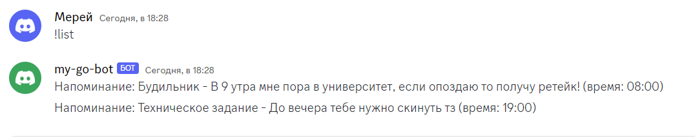
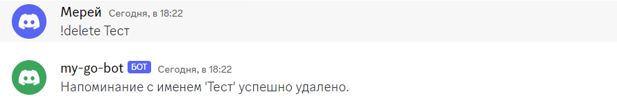

# Архитектура:

C:.\
│   DOC.md \
│   go.mod \
│   go.sum \
│   main.go \
│   README.md \
│ \
├───bot \
│       bot.go \
│       remind.go \
│ \
└───db \
│       db.txt 

# команды 

!info \
!remind \
!remindList \
!remindDelete \

Вся их логика написано в ReadMe файле

# БД

мой код парсит сообщение от пользователя и добавляет данные о напоминании в текстовый файл db.txt в папке db. \
затем для вывода списка команд также читает этот текстовый файл и выводит список записей по channelID

команда !remind - 'имя' - 'описание' - 'время'
ставит напоминание и во укзанное время отправляет описание напоминании благодоря запущенным горутинам \
пример: 

команда !list выводит все напоминания пользователя \
пример:

команда !delete 'имя напоминаний' удаляет напоминание оп данному имени \
пример:
